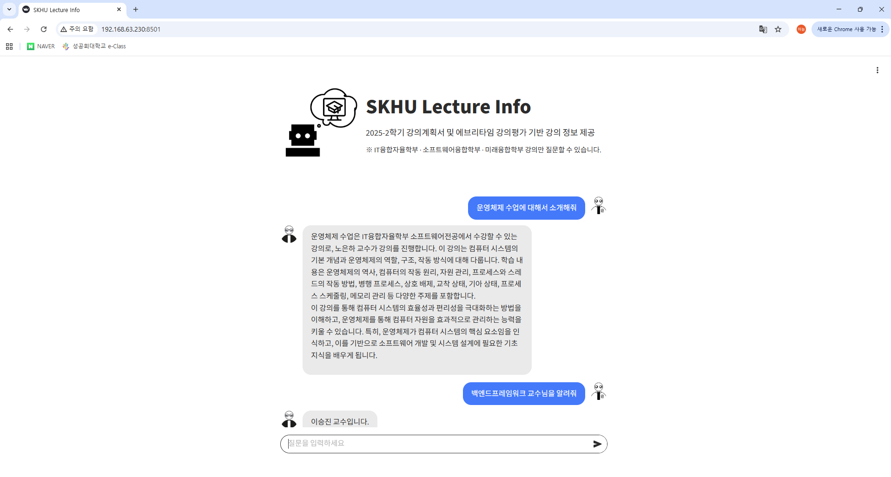

# 🎓 강의 정보 및 평가 통합 RAG 챗봇 (Lecture Info AI Assistant)

> **강의계획서와 강의평가를 한 번에!** > 대학생들의 수강 신청을 돕기 위한 **RAG(Retrieval-Augmented Generation)** 기반의 AI 챗봇 서비스입니다.

 
 
 
 


## 📖 프로젝트 소개 (Overview)

대학생들이 수강 신청 정보를 얻기 위해 학교 포털(강의계획서)과 커뮤니티(에브리타임 강의평가)를 번갈아 확인해야 하는 불편함을 해결하고자 개발되었습니다.
**LangChain**과 **Open Source LLM**을 활용하여 흩어진 강의 정보를 통합하고, 자연어 대화를 통해 원하는 정보를 쉽고 빠르게 얻을 수 있습니다.

### 🎯 주요 기능
* **자연어 질의응답:** "머신러닝입문 선수과목 알려줘", "이 수업 학점 잘 주나요?" 등 대화형 정보 검색.
* **통합 정보 제공:** 강의 학습 내용, 선수 과목, 수업 방식, 그리고 실제 수강생들의 장단점 평가 요약 제공.
* **검색 증강 생성 (RAG):** 환각(Hallucination)을 최소화하고 정확한 데이터베이스 기반 답변 생성.

---

## 🛠️ 기술 스택 (Tech Stack)

| 구분 | 기술 / 도구 | 설명 |
| :--- | :--- | :--- |
| **LLM** | **Qwen/Qwen3-4B** | 한국어 성능이 우수한 4B 경량화 모델 (4-bit Quantization 적용) |
| **Embedding** | **Snowflake/arctic-embed-l-v2.0** | 다국어 및 검색 성능이 최적화된 임베딩 모델 |
| **Vector DB** | **ChromaDB** | 로컬 환경에서의 문서 벡터 저장 및 검색 |
| **Backend** | **FastAPI** | REST API 서버 구축 및 모델 서빙 |
| **Frontend** | **Streamlit** | 사용자 친화적인 채팅 인터페이스 구현 |
| **Infra** | **Docker & NVIDIA CUDA** | GPU 가속 환경 및 배포 자동화 (CUDA 12.1) |

---

## 🏗️ DB구축 (Chroma Embedded DataBase)
1. 에브리타임, 강의계획서 데이터를 엑셀 파일로 직접 수집
2. 엑셀 파일을 csv 형태로 변환 후, 전처리(None값->'없음', 강의평가 -> '강의평가_좋음','강의평가_나쁨')
3. csv파일롤 txt파일로 변환
4. txt파일을 Document(metadata=[정보_분류], content_page=[정보]) 형태로 저장 후, 임베딩
```
## 저장된 Document 블럭 예시
[Document(metadata={'교수명': '홍은지', '강의명': '데이터베이스', 'type': '학습내용'}, page_content='강의명: 데이터베이스\n교수명: 홍은지\n학부명: 소프트웨어융합학부\n학과명: 소프트웨어융합전공\n\n[학습내용]\n- 강의를 통해 데이터베이스의 개념을 이해한 후, 실제 데이터베이스 관리 시스템을 사용하는 방법을 숙지하여 실습한다. 권한없는 사용자가 데이터를 악용하는 것을 방지하는 기법에 대해 학습한다. 1) 데이터베이스 관련 이론 학습 2) 데이터모델링 기법 학습 및 적용 3) 기초 SQL 언어 학습 및 적용')]
```
5. 임베딩 된 vector db를 rag_output/vectordb에 저장


## 🏗️ 시스템 아키텍처 (Architecture)

본 서비스는 **User Interface**, **Backend Server**, **RAG Engine**의 3계층 구조로 이루어져 있습니다.

```bash
graph TD
    User([사용자]) -->|질문 입력| FE[Frontend (Streamlit)]
    FE -->|REST API 요청| BE[Backend (FastAPI)]
    
    subgraph "RAG Engine"
        BE -->|1. 쿼리 분석| QA[Query Analyzer]
        QA -->|2. 벡터 검색| VDB[(ChromaDB)]
        VDB -->|3. 관련 문서 추출| DOCS[Documents]
        DOCS -->|4. 프롬프트 구성| PMT[Prompt Template]
        PMT -->|5. 답변 생성| LLM[LLM (Qwen3-4B)]
    end
    
    LLM -->|응답 반환| BE
    BE -->|답변 출력| FE
```
---

## 🏗️질문이 들어온 후 데이터 흐름
1. 질문(query) 입력
2. 질문 텍스트가 검색할 문서 개수(k), 필요 정보를 반환하는 Sub LLM으로 이동
```
## Sub LLM 출력 예시
{'k': 5, '필요 정보': ['교수명', '강의명', '학습내용']}
```
3. k개 개수만큼 문서 검색(검색기: similarity_search_with_score)
```
## 문서 검색 예시
[Document(metadata={'강의명': '고급Python프로그래밍', '교수명': '홍성준', 'type': '선수과목과수강요건'}, page_content='강의명: 고급Python프로그래밍\n교수명: 홍성준\n학부명: 미래융합학부\n학과명: 인공지능전공\n\n[선수과목과수강요건]\n- Python프로그래밍'),
 Document(metadata={'강의명': '머신러닝입문', 'type': '선수과목과수강요건', '교수명': '홍성준'}, page_content='강의명: 머신러닝입문\n교수명: 홍성준\n학부명: 미래융합학부\n학과명: 인공지능전공\n\n[선수과목과수강요건]\n- Python프로그래밍')...]
 ```
 4. 검색된 문서를 필요 정보 항목으로 필터링
 5. 전처리 된 검색 문서를 프롬프트에 추가
 ```
 ## 최종 프롬프트 예시
 당신은 강의 추천을 돕는 AI 조교입니다. 아래 정보를 바탕으로 질문에 답해주세요.

[정보]
강의명: 데이터베이스
교수명: 홍은지
학부명: 소프트웨어융합학부
학과명: 소프트웨어융합전공

[학습내용]
- 강의를 통해 데이터베이스의 개념을 이해한 후, 실제 데이터베이스 관리 시스템을 사용하는 방법을 숙지하여 실습한다. 권한없는 사용자가 데이터를 악용하는 것을 방지하는 기법에 대해 학습한다. 1) 데이터베이스 관련 이론 학습 2) 데이터모델링 기법 학습 및 적용 3) 기초 SQL 언어 학습 및 적용

강의명: 데이터사이언스입문
교수명: 이상윤
학부명: 미래융합학부
학과명: 인공지능전공

[학습내용]
- 1. 데이터 전처리, 시각화, 결과 분석 등 일련의 데이터 분석 과정을 학습한다. 2. 주어진 데이터로부터 문제를 정의하고 단계적으로 해결할 수 있다. 3. 파이썬 라이브러리를 이용하여 데이터를 분석하고 그 결과를 시각화할 수 있다. 4. 학습한 내용을 공공 데이터 등의 실전 데이터에 적용할 수 있다.

강의명: 데이터통신
교수명: 박정식
학부명: 소프트웨어융합학부
학과명: 소프트웨어융합전공

[학습내용]
- 1. 데이터통신 개요를 설명하며, 강좌 개요와 데이터 통신의 개요에 대하여 배운다. 2. 인터넷의 역사에 대하여 배운다. 특히, 과거의 통신 수단과 인터넷의 태동, 현재의 인터넷에 대하여 개념적으로 이해한다.  3. 물리계층에 대해 이해하며, 프로토콜의 계층 구조에 대하여 이해하며, TCP/IP 프로토콜의 구조와 각 계층의 이름과 기능에 대하여 이해한다. 4. OSI 모델에 대해 이해하고, TCP/IP와의 차이점에 대해 배운다. 5. 물리계층의 전반적인 이해와 디지털-아날로그 데이터와 신호에 대하여 배우며, 아날로그 데이터와 신호, 디지털 데이터와 신호에 대해 분석한다. 6. 복합 아날로그 신호로서 디지털 신호를 이해하며, 디지털 신호를 전송하는 방법을 배운다. 7. 전송 매체에서 발생될 수 있는 여러 가지 손상과 함께 전송 데이터 률에 영향을 끼치는 요소에 대하여 배우며, 통신의 성능에 영향을 끼치는 요소에 대하여 배운다. 8. 디지털 전송을 위해 Digital-to-Digital Conversion에 대하여 배우며, Digital-to-Digital Conversion을 위한 코딩 방식에 대하여 배운다.  9. Analog-to-Digital Conversion과 Digital-to-Analog Conversion에 대하여 배운다.  10. Analog-to-Analog Coonversion과 멀티플렉싱의 개념에 대하여 배운다. 11. 데이터 통신을 위한 Guided와  Unguided  전송 매체의 특성에 대하여 배운다.

[질문]
데이터베이스 강의의 학습 내용은 어떻게 돼?

[규칙]
**반드시 한글로 답변해주세요**

[답변]
```
 6. LLM


## 🚀 실행 방법 (How to Run)

이 프로젝트는 Docker 환경에서의 실행을 권장합니다. (NVIDIA GPU 사용 권장)

### 1. 사전 요구 사항 (Prerequisites)
* [Docker](https://docs.docker.com/get-docker/)
* [NVIDIA Container Toolkit](https://docs.nvidia.com/datacenter/cloud-native/container-toolkit/install-guide.html) (GPU 가속을 위해 필수)
* Git LFS (Large File Storage for Models)

### 2. 설치 및 실행 (Docker)

**1) 저장소 복제**
```bash
git clone [https://github.com/SKHU-OSS-2025-2/final-project-a-lecture-info.git](https://github.com/SKHU-OSS-2025-2/final-project-a-lecture-info.git)
cd final-project-a-lecture-info
```

**2) Docker 이미지 빌드**
```bash
docker build -t skhu-lecture-bot .
```

**3) 컨테이너 실행**
```bash
docker run --gpus all -p 8501:8501 -p 8000:8000 --name lecture-bot skhu-lecture-bot
```

**4) 접속**
```bash
Web UI: http://localhost:8501
API Docs: http://localhost:8000/docs
```

## 📂 프로젝트 구조 (Directory Structure)

```bash
.
├── api_server.py       # FastAPI 백엔드 서버 (LLM 통신)
├── ui_app.py           # Streamlit 프론트엔드 (채팅 UI)
├── .github/workflows   # GitHub Actions
│   └── deploy.yaml
├── models/             # model 저장 폴더
├── .github/workflows   # GitHub Actions
│   └── config.toml     # Streamlit 배경 설정
├── images/s            # Streamlit 이미지 모음
├── data/
│   └── text_data.txt   # 강의 정보 원본 데이터
├── utils/              # 핵심 로직 모듈
│   ├── chatbot.py      # RAG 파이프라인 제어
│   ├── ingest.py       # 텍스트 데이터 전처리 및 Vector DB 생성
│   ├── llm.py          # LLM 모델 로딩 (BitsAndBytes 4-bit)
│   ├── rag.py          # 문서 검색 (Retriever) 로직
│   ├── prompt.py       # 프롬프트 엔지니어링 템플릿
│   └── embedding.py    # 임베딩 모델 설정
├── Dockerfile          # Docker 이미지 빌드 설정
├── start.sh            # 서비스 실행 스크립트 (Backend + Frontend)
└── requirements.txt    # 의존성 패키지 목록
```
## 모델 비교(Qwen3-4B, Qwen2.5-3B-instruct)
- Qwen2.5-3B-instruct
1. 장점: Qwen3-4B보다 답변까지 대략 10초 더 빠름
2. 단점: 긴 프롬프트에서 정보 소실
- Qwen3-4B
1. 장점: 긴 프롬프트에 강력
2. 단점: 답변까지 느림

- (서브모델:Qwen2.5-3B-instruct 메인모델:Qwen3-4B) vs (서브, 메인모델:Qwen3-4B)

||2.5-3B //3-4B|3-4B//3-4B|
|------|---|---|
|시간|14.22초|27.29초|
|정확도|60%|90%|

-> 출력 시간보다 정확도가 우선
-> Sub LLM, Main LLM 둘 다 Qwen3-4B 선택

## 답변 예시
```
질문 1 : 데이터베이스 강의의 학습 내용은 어떻게 돼?
답변 : 데이터베이스 강의의 학습 내용은 다음과 같습니다:

1. 데이터베이스의 개념을 이해하고, 실제 데이터베이스 관리 시스템을 사용하는 방법을 숙지하여 실습한다.
2. 권한없는 사용자가 데이터를 악용하는 것을 방지하는 기법에 대해 학습한다.
3. 데이터베이스 관련 이론 학습
4. 데이터모델링 기법 학습 및 적용
5. 기초 SQL 언어 학습 및 적용

질문 2 : 데이터사이언스입문 강의는 어때?
답변: "데이터사이언스입문" 강의는 데이터 분석의 기초를 배우는 강의입니다. 이 강의는 데이터 전처리, 시각화, 결과 분석 등 데이터 분석의 주요 과정을 학습하며, 주어진 데이터로부터 문제를 정의하고 단계적으로 해결할 수 있는 능력을 키웁니다. 또한, 파이썬 라이브러리를 이용하여 데이터를 분석하고 그 결과를 시각화하는 실습 능력도 배우게 됩니다. 학습한 내용을 공공 데이터 등의 실전 데이터에 적용할 수 있는 실전적인 학습이 이루어집니다. 이 강의는 데이터 기반 사고의 기초를 습득하고, 데이터 분석의 기본적인 개념을 이해하는 데 도움이 되는 좋은 강의입니다.
```
---
## 최종화면


## 역할 분담
- 이상민 : 팀장, 기능 구현 및 전체적인 코드 리팩토링
- 이하늘 : 코드 모듈화, retriever 기능 구현
- 홍효정 : 데이터 수집 및 전처리, vectordb 생성
- 이정은 : 데이터 수집 및 전처리, Streamlit UI 구현

### 서비스링크
http://192.168.63.230:8501
